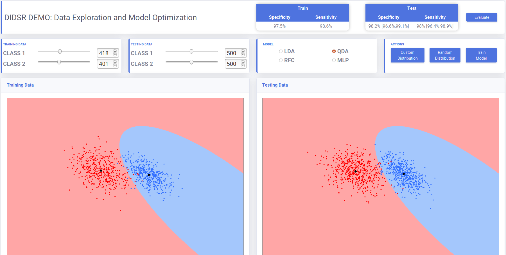
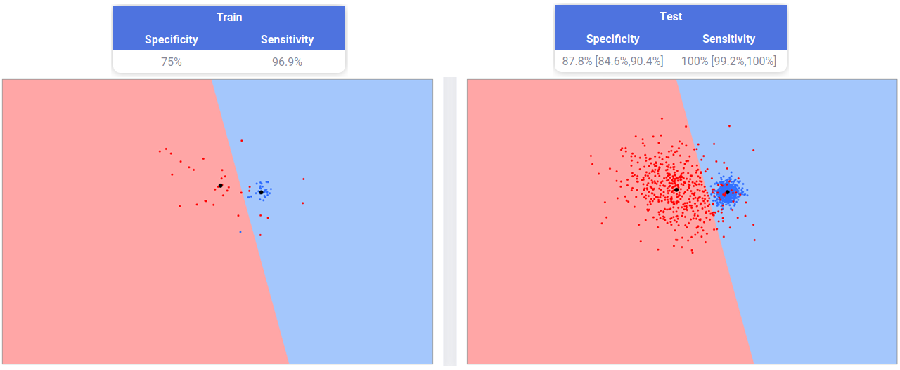
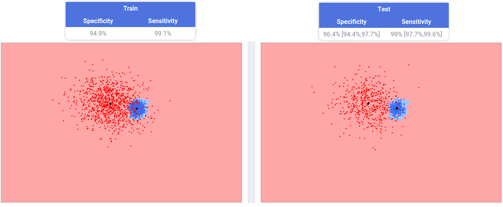
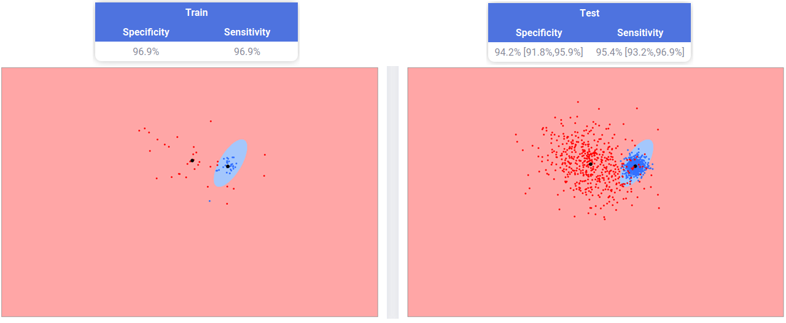

# AI DEMO (Data Exploration & Model Optimization)


AI/ML DEMO is an interactive web tool that helps users to explore and gain hands-on-experience in essetntial concepts in machine learning. This web tool offers interactions with datasets in feature space as well as interactions with machine learning hyper-parameters. Users can explore various concepts in machine learning inlcuding training/test data distribution, under/over fitting, the bias/variance traid-off, neural networks, performance metrics, etc. By interactively engaging with these concepts, non-experts can deepen their understanding and gain practical insights into the world of machine learning.



----
Below illustrates some example concepts based on user-selected training/test data points


<p align="center">
Linear Discriminant Analysis (High Bias)



---


<p align="center">
Deep Neural Network (High Variance)


---
<p align="center">
Deep Neural Network (Larger Pool of Training Data)



---
<p align="center">
Quadratic Discriminant Analysis 



## Author
Jacob McIntosh

## Requirenment
Python 3.10 or higher

## Installation
Ubuntu 18.04
```
1. pip install -r requirements.txt
2. cd src
3. python manage.py collectstatic
4. python manage.py runserver 0.0.0.0:8000
5. Open host ip address:8000 on browser

```